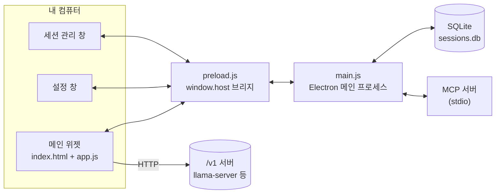

<div align="center">

# oh-my-local-assistant

**로컬 LLM을 위한 아주 작은 상주형 위젯. 클라우드도, 계정도, 번들러도 없다.**

[](#요구-사항)
[](#요구-사항)
[](package.json)
[](#디렉터리-구조)
[](https://github.com/KyungMinseo1/oh-my-local-assistant/pulls)

[English](README.md) · [시작하기](#시작하기) · [특징](#특징) · [아키텍처](#아키텍처)

</div>

---

## 목차

- [개요](#개요)
- [특징](#특징)
- [요구 사항](#요구-사항)
- [시작하기](#시작하기)
- [설정](#설정)
- [디렉터리 구조](#디렉터리-구조)
- [아키텍처](#아키텍처)
- [단축키](#단축키)
- [알려진 거친 부분들](#알려진-거친-부분들)

## 개요

화면 구석에 조그맣게 떠 있다가, `/v1` OpenAI 호환 엔드포인트를 여는 아무 서버든 붙여서 쓰는 위젯이다 — `llama-server`든, `ollama serve --openai`든, vLLM이든 상관없다. 계정도 없고 클라우드도 안 타는데, 애초에 모델을 직접 구동하는 앱이 아니라서 그렇다. 그냥 타이핑하는 창일 뿐이다.

번들러도 프레임워크도 없이 평범한 파일 몇 개, 그리고 세션 저장용 SQLite 파일 하나가 전부다. 로컬 모델이 이미 어딘가에서 돌고 있다면 그 위에 얹어두고 평소엔 신경 안 써도 된다.

> [!NOTE]
> 이 저장소는 클라이언트 쪽뿐이다. OpenAI 호환 `/v1` 서버부터 띄워두자 — 이 위젯 혼자서는 모델을 구동하지 않는다.

## 특징

평소엔 안 보인다. 창은 화면 전체를 덮고 있지만 버블과 (열렸을 때의) 패널 두 군데를 뺀 나머지는 전부 클릭이 그대로 통과되기 때문에, 뒤에 있는 걸 클릭하려는데 이 위젯이 가로채는 일이 없다.

| | |
| --- | --- |
| **세션 · 프로젝트** | 대화는 세션 단위로 완전히 분리되고, 세션들을 프로젝트(폴더 개념이지 실제 파일시스템 폴더는 아니다)로 묶을 수 있다. 전부 로컬 SQLite 파일 하나에 저장되니 앱을 꺼도 안 날아간다. |
| **워크스페이스 도구** | 폴더 하나를 지정해두면 모델이 그 안 파일을 읽고, glob으로 파일명을 찾고, 내용을 grep할 수 있다. 도구마다 켜고 끄는 것도, 매번 승인받을지 항상 허용할지도 각각 따로 정한다. |
| **MCP 서버** | Claude Desktop에 넣던 MCP 서버 설정을 그대로 갖다 써도 된다 — 같은 JSON을 넣으면 그 도구들도 내장 도구와 똑같은 승인 흐름 안에서 나타난다. |

## 요구 사항

- Windows (배포용 빌드는 win/x64 타깃. `npm start`로 다른 OS에서 돌아갈 수도 있지만 검증은 안 해봤다)
- Node.js 18 이상
- `/v1/chat/completions`를 여는 OpenAI 호환 서버 — 개발할 때는 [llama.cpp](https://github.com/ggml-org/llama.cpp)의 `llama-server`를 기준으로 붙였다

## 시작하기

```bash
git clone https://github.com/KyungMinseo1/oh-my-local-assistant.git
cd oh-my-local-assistant
npm install
npm start
```

트레이에 자리 잡고 상주한다. `Ctrl+Shift+Space`로 위젯을 켜고 끌 수 있다.

소스에서 바로 실행하는 대신 설치 파일을 뽑고 싶다면:

```bash
npm run build     # → dist/*.exe (NSIS)
```

## 설정

앱 자체에 설정할 환경 변수는 없다 — 전부 톱니바퀴 아이콘 뒤에 있다.

| 카테고리 | 내용 |
| --- | --- |
| 일반 | BASE URL(기본값 `http://127.0.0.1:8080/v1`), 모델명, MAX TOKENS |
| 시스템 프롬프트 | 모든 요청 앞에 붙는다. 세션 히스토리에는 저장 안 됨 |
| 워크스페이스 & 도구 | 모델이 만질 수 있는 폴더, 도구별 사용 여부 · 항상 허용 토글 |
| MCP 서버 | `{ "이름": { "command": ..., "args": [...] } }` 형태의 JSON — 세션과 무관한 전역 설정 |

여기서 바꾼 건 전부 로컬 DB에 바로 저장된다:

| OS | 경로 |
| --- | --- |
| Windows | `%APPDATA%/local-assistant/sessions.db` |
| macOS | `~/Library/Application Support/local-assistant/sessions.db` |
| Linux | `~/.config/local-assistant/sessions.db` |

### 모델 서버까지 같이 띄우기

`llama-server`랑 위젯을 매번 따로 켜는 게 귀찮으면 `start_all.ps1` 하나로 같이 띄울 수 있다.

```powershell
copy .env.example .env
# .env를 열어 LLAMA_CPP_DIR / MODEL_PATH를 채운다

./start_all.ps1
```

> [!TIP]
> `-ngl`, `--threads`, `-c`, 캐시 타입 같은 GPU/CPU 튜닝 인자는 `.env`가 아니라 스크립트 안에 그대로 박혀 있다 — 각자 하드웨어에 맞는 값이라 알아서 잘 넣어줄 수가 없으니, 파일을 열어서 직접 조정하는 게 맞다.

## 디렉터리 구조

```
oh-my-local-assistant/
├─ main.js              # Electron 메인 프로세스: 창/트레이/클릭통과, IPC, 워크스페이스 도구, MCP 클라이언트
├─ preload.js            # 렌더러가 Node에 닿는 유일한 통로 — window.host
├─ db.js                 # SQLite 기반 세션/설정/프로젝트 저장소
├─ renderer/
│  ├─ index.html, app.js       # 위젯 본체: 버블/패널, 스트리밍, 도구 호출 루프
│  ├─ settings.html, settings.js  # 설정 창
│  └─ sessions.html, sessions.js  # 세션 관리 창
├─ .env.example          # start_all.ps1용 설정 템플릿
├─ start_all.ps1         # 서버 + 위젯 동시 실행용 (선택 사항)
└─ package.json
```

## 아키텍처



`main.js`가 작업 영역 전체 크기의 `BrowserWindow`를 하나 만들고 처음부터 클릭 통과 상태로 켠다. 마우스가 움직일 때마다 `app.js`의 `hitTest()`가 커서가 버블 위인지 열린 패널 위인지를 보고 클릭 통과를 그때그때 켜고 끈다 — 나머지는 전부 바탕화면으로 그대로 뚫고 지나간다. 새 인터랙티브 UI를 추가하면서 이 목록에 안 넣으면, 그 UI는 그냥 조용히 클릭이 안 되는 채로 남는다.

렌더러는 Node를 직접 건드리지 않는다. `preload.js`가 `window.host` 객체 하나(세션 CRUD, 도구 실행, 워크스페이스 폴더 선택, MCP 재연결까지 전부)를 노출하고, 이 파일은 위젯·설정·세션 관리 세 창 모두에 수정 없이 그대로 공유된다 — 어느 창도 창별로 다른 상태가 필요 없기 때문이다.

도구 호출은 루프로 돈다. `app.js`의 `send()`가 정해진 횟수만큼 완성 라운드를 돌리고, 모델이 `tool_calls`를 내놓을 때마다 `handleToolCalls()`가 (항상 허용이 아니면 승인 팝업을 거쳐) 하나씩 실행한 뒤 결과를 다시 넣고 한 바퀴 더 돈다. 이 도구들이 건드리는 모든 경로는 `main.js`의 `resolveInWorkspace()`를 거치는데, 지정된 폴더 바깥으로 풀리는 경로는 전부 예외를 던진다 — `../`도, 딴 곳을 가리키는 절대경로도 안 된다.

MCP 서버는 일단 연결되고 나면 내장 도구와 같은 취급을 받는다. 각 서버의 도구는 `mcp__<서버>__<도구>` 이름으로 나타나고 같은 승인 흐름을 탄다. 다만 연결은 전부 아니면 전무다 — 설정을 저장하거나 앱을 다시 시작하면 기존 연결을 다 끊고 처음부터 다시 붙는다. 뭐가 바뀌었는지는 따로 비교하지 않는다.

저장소는 JSON 파일이 아니라 SQLite다. `db.js`가 모든 읽기/쓰기를 관리하고, 어느 창에서 뭔가 바뀌면 `store:changed`를 IPC로 브로드캐스트해서 다른 창들이 포커스를 되찾을 때까지 기다리지 않고 바로 갱신된다.

이보다 더 자세한 내용은 저장소 루트의 `CLAUDE.md`에 있다.

## 단축키

| 키 | 동작 |
| --- | --- |
| `Ctrl+Shift+Space` | 위젯 표시/숨김 |
| `Enter` | 전송 — 생성 중이면 중지 |
| `Shift+Enter` | 줄바꿈 |
| `Esc` | 생성 중지 |

## 알려진 거친 부분들

- 세션 히스토리 전체를 매 요청마다 다시 보낸다. 요약이나 절삭이 없어서, 대화가 길어지면 서버가 걸어둔 컨텍스트 한도에 결국 부딪힌다.
- 마크다운 렌더링은 직접 짠 것이다(제목·목록·굵게/기울임/취소선·코드·인용·링크). 코드 블록 안 구문 강조는 아직 없다.
- `alwaysOnTop`이 `screen-saver` 레벨이라 전체화면 앱 위에도 뜬다. 게임이나 다른 always-on-top 도구랑 충돌하면 `main.js`에서 `'floating'`으로 낮추면 된다.

> [!WARNING]
> 원격 사용을 염두에 두고 만든 게 아니다. 워크스페이스 도구는 Electron 프로세스가 실제로 돌아가는 그 컴퓨터의 파일시스템만 본다.
