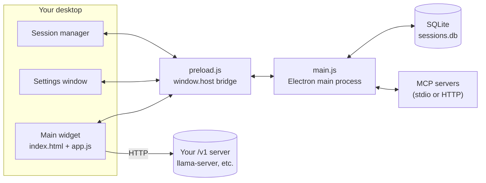

<div align="center">

# oh-my-local-assistant

**A tiny always-on-top widget for your local LLM. No cloud, no accounts, no bundler.**

[](#requirements)
[](#requirements)
[](package.json)
[](#directory-layout)
[](https://github.com/KyungMinseo1/oh-my-local-assistant/pulls)

[한국어](README.ko.md) · [Quick Start](#quick-start) · [Features](#features) · [Architecture](#architecture)

</div>

---

## Table of Contents

- [Overview](#overview)
- [Features](#features)
- [Requirements](#requirements)
- [Quick Start](#quick-start)
- [Configuration](#configuration)
- [Directory Layout](#directory-layout)
- [Architecture](#architecture)
- [Shortcuts](#shortcuts)
- [Rough Edges](#rough-edges)

## Overview

A little bubble that lives in the corner of your screen and talks to whatever OpenAI-compatible `/v1` server you point it at — `llama-server`, `ollama serve --openai`, vLLM, whatever you've got running. No account, no cloud calls, no telemetry, since it doesn't run any model itself — it's just the window you type into.

It's a handful of plain files, no bundler or framework, plus one SQLite file for sessions. If you've already got a model running locally, this sits on top of it and otherwise stays out of your way.

> [!NOTE]
> This repo is the client only. Get an OpenAI-compatible `/v1` server running first — this widget doesn't run a model on its own.

## Features

The widget is invisible until you need it. The window covers your whole screen but is fully click-through except for two spots — the bubble, and the panel when it's open — so it never steals a click meant for something behind it.

Beyond that:

| | |
| --- | --- |
| **Sessions & projects** | Conversations live in separate sessions, groupable into projects (a folder-like concept, not a filesystem one). Everything's kept in a local SQLite file, so closing the app doesn't lose anything. |
| **Workspace tools** | Point it at a folder and the model can read files in it, search filenames by glob, and grep contents. Each capability toggles independently, and each can be auto-approved or gated behind a one-off confirmation. |
| **MCP servers** | Any MCP server you'd configure for Claude Desktop works here too — drop the same JSON in and its tools show up in the same approval flow as the built-in ones. |

## Requirements

- Windows (the packaged build targets win/x64; `npm start` may work elsewhere but hasn't been tested there)
- Node.js 18+
- Something serving an OpenAI-compatible `/v1/chat/completions` endpoint — [llama.cpp](https://github.com/ggml-org/llama.cpp)'s `llama-server` is what this was built against

## Quick Start

```bash
git clone https://github.com/KyungMinseo1/oh-my-local-assistant.git
cd oh-my-local-assistant
npm install
npm start
```

It parks itself in the system tray. `Ctrl+Shift+Space` toggles the widget on and off.

To produce a Windows installer instead of running from source:

```bash
npm run build     # → dist/*.exe (NSIS)
```

## Configuration

There are no environment variables to set for the app itself — everything lives behind the gear icon:

| Category | What's there |
| --- | --- |
| General | Base URL (defaults to `http://127.0.0.1:8080/v1`), model name, max tokens |
| System prompt | Prepended to every request; not saved into session history |
| Workspace & tools | Which folder the model can touch, and per-tool enable / always-allow toggles |
| MCP servers | A JSON blob of `{ "name": { "command": ..., "args": [...] } }` (stdio) or `{ "name": { "type": "http", "url": ... } }` (streamable HTTP) — global, not per-session |

Everything you set gets written straight to a local database:

| OS | Path |
| --- | --- |
| Windows | `%APPDATA%/local-assistant/sessions.db` |
| macOS | `~/Library/Application Support/local-assistant/sessions.db` |
| Linux | `~/.config/local-assistant/sessions.db` |

### Launching the model server alongside it

If you're tired of starting `llama-server` and the widget separately, `start_all.ps1` does both in one shot:

```powershell
copy .env.example .env
# edit .env — fill in LLAMA_CPP_DIR and MODEL_PATH

./start_all.ps1
```

> [!TIP]
> The GPU/CPU tuning flags (`-ngl`, `--threads`, `-c`, cache types, ...) live directly in the script rather than in `.env` — they're specific to whatever hardware you're running on, so open the file and adjust them rather than expecting sane defaults.

## Directory Layout

```
oh-my-local-assistant/
├─ main.js              # Electron main process: window/tray/click-through, IPC, workspace tools, MCP client
├─ preload.js            # The one bridge the renderer has to Node — window.host
├─ db.js                 # SQLite-backed sessions/settings/projects
├─ renderer/
│  ├─ index.html, app.js       # the widget itself: bubble/panel, streaming, tool-call loop
│  ├─ settings.html, settings.js  # settings window
│  └─ sessions.html, sessions.js  # session manager window
├─ .env.example          # template for start_all.ps1's config
├─ start_all.ps1         # optional launcher for server + widget together
└─ package.json
```

## Architecture



`main.js` sizes a single `BrowserWindow` to the whole work area and starts it fully click-through. On every mouse move, `app.js`'s `hitTest()` checks whether the cursor is over the bubble or the open panel and flips click-through on or off accordingly — everything else falls straight through to the desktop behind it. Add new interactive UI without registering it there and it'll just quietly be unclickable.

The renderer never touches Node directly — `preload.js` exposes one `window.host` object (session CRUD, tool execution, workspace picking, MCP reconnects, all of it), and the exact same file is shared unchanged across the widget, the settings window, and the session manager, since none of the three need anything window-specific from it.

Tool calls run as a loop. `send()` in `app.js` drives a capped number of completion rounds, and whenever the model comes back with `tool_calls`, `handleToolCalls()` executes each one — through a confirmation prompt, unless it's marked always-allow — and feeds the results back in before looping again. Every path those tools touch is resolved through `resolveInWorkspace()` in `main.js`, which throws on anything that would land outside the folder you configured: no `../`, no absolute path pointing somewhere else.

MCP servers, once connected, get folded into the same system as the built-in tools: each server's tools show up namespaced as `mcp__<server>__<tool>` and go through the same approval flow. Connecting is all-or-nothing, though — saving settings or restarting the app tears down every connection and reconnects from scratch rather than diffing what actually changed.

Storage is SQLite, not a JSON blob. `db.js` owns every read and write, and whichever window changes something broadcasts `store:changed` over IPC so the other open windows update right away instead of going stale until you switch focus back to them.

`CLAUDE.md` in the repo root goes considerably deeper into all of this.

## Shortcuts

| Key | Does what |
| --- | --- |
| `Ctrl+Shift+Space` | Show / hide the widget |
| `Enter` | Send — or stop, if it's already generating |
| `Shift+Enter` | Newline |
| `Esc` | Stop generating |

## Rough Edges

- Full session history gets resent on every request. There's no summarization or truncation, so a long-running session will eventually hit whatever context limit your server enforces.
- Markdown rendering is hand-rolled (headings, lists, bold/italic/strikethrough, code, blockquotes, links) — no syntax highlighting inside code fences yet.
- `alwaysOnTop` runs at the `screen-saver` level, so it floats above fullscreen apps too. If that fights with a game or another always-on-top tool, drop it to `'floating'` in `main.js`.

> [!WARNING]
> This was never designed for remote use. Workspace tools only ever see the filesystem of whichever machine is actually running the Electron process.
